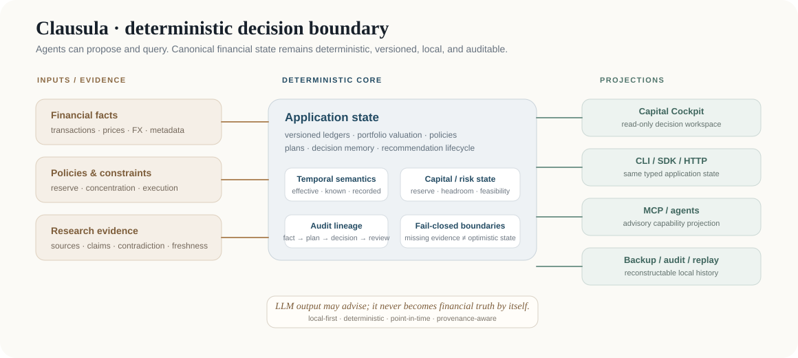

# Clausula

Clausula is a local-first, deterministic investment decision system. It keeps portfolio truth, policy constraints, research evidence, recommendations, execution feasibility, decisions, and reviews auditable without making an LLM the system of record.

<p align="center">
  
</p>

## Why Clausula

- Financial calculations use deterministic Python services and `Decimal`.
- Historical facts are append-only and retain source provenance.
- As-of queries distinguish `effective_at`, `known_at`, and `recorded_at` so look-ahead is explicit.
- Agent, MCP, HTTP, CLI, SDK, and local workspace surfaces project the same deterministic application state instead of owning financial truth.
- Missing data and execution facts fail closed instead of becoming optimistic assumptions.
- Version 0.x does not place brokerage orders autonomously.

## Quick start

Requires Python 3.12 or newer.

```bash
python -m venv .venv
source .venv/bin/activate
python -m pip install -e .

# Inspect the capability surface and validate local state.
clausula capability list
clausula system check

# Create a local account; commands return structured JSON.
clausula account create DemoInstitution "Paper Account"

# Open the loopback-only, read-only Capital Cockpit.
clausula-workspace
```

The Capital Cockpit is decision-first rather than tracker-first. Its primary flow is:

`Capital State → Policy Boundary → Attention → Evidence → Plan / Recommendation → Execution Feasibility → Decision → Review`

The workspace keeps `as_of` and `known_as_of` visible and currently surfaces:

- complete/partial portfolio valuation, concentration and data gaps;
- **Capital Envelope**: total cash, policy-implied reserve, deployable cash and reserve shortfall;
- signed **Risk Headroom** to policy boundaries;
- versioned **Execution Contracts** and plan feasibility (`executable`, `conditional`, `blocked`);
- material Attention events;
- Recommendation inbox and explicit recommendation → decision lineage;
- Evidence pressure using evidence age and explicit contradictions rather than an opaque score;
- decision review queue with due/upcoming/completed state.

The UI exposes no write controls. The underlying 0.x HTTP capability projection remains a local integration surface rather than a remote authentication boundary.

## Performance model

Read paths use bounded batch projections rather than entity-count N+1 queries:

- ordered transaction + legs materialization for ledger replay;
- batched instrument, accepted-price and FX resolution for one point-in-time snapshot;
- shared market reads across portfolio accounts;
- incremental multi-date replay instead of a full ledger replay per performance date.

Structural query-growth contracts are tested in CI. Reproducible synthetic benchmark profiles are documented in [`docs/product/read-benchmarks.md`](docs/product/read-benchmarks.md).

## Architecture

| Layer | Responsibility |
| --- | --- |
| `clausula/domain` | immutable domain types and contracts |
| `clausula/application` | deterministic use cases, read models and repository ports |
| `clausula/analytics` | portfolio, policy, planning, performance, execution and cost-basis calculations |
| `clausula/adapters` | SQLite, backup, audit, migrations, MCP and local derived projections |
| `clausula/capabilities` | permissioned typed capability registry shared by external surfaces |
| `clausula/api`, `clausula/ui`, `cli.py`, `sdk.py` | local HTTP/workspace, CLI and Python projections |

The current implementation includes the kernel, ledger, market/portfolio analytics, policy-as-code, deterministic planning, decision memory, research evidence graph, recommendation lifecycle, material attention, Capital Envelope/Risk Headroom, Execution Contracts, fast replay/read paths, and Decision Workspace v1.

Product semantics are documented under [`docs/product/`](docs/product/README.md). See [`docs/project/STATUS.md`](docs/project/STATUS.md) for frozen milestones, verification evidence, deferred capabilities, and known risks.

## Verification

```bash
python -m pytest -q
python -m compileall -q clausula tests
git diff --check
python -m build
```

## Security and data boundary

Clausula is local-first. Runtime financial data, databases, backups, agent state, tool configuration, and credentials do not belong in this repository. The 0.x HTTP and MCP projections are integration adapters rather than authenticated remote-service boundaries; keep them local or place an authenticated gateway in front of them. See [`SECURITY.md`](SECURITY.md) before exposing any service outside the host.

## License

MIT. See [`LICENSE`](LICENSE).
